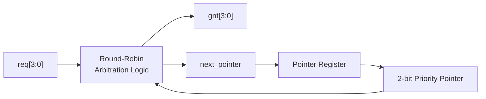
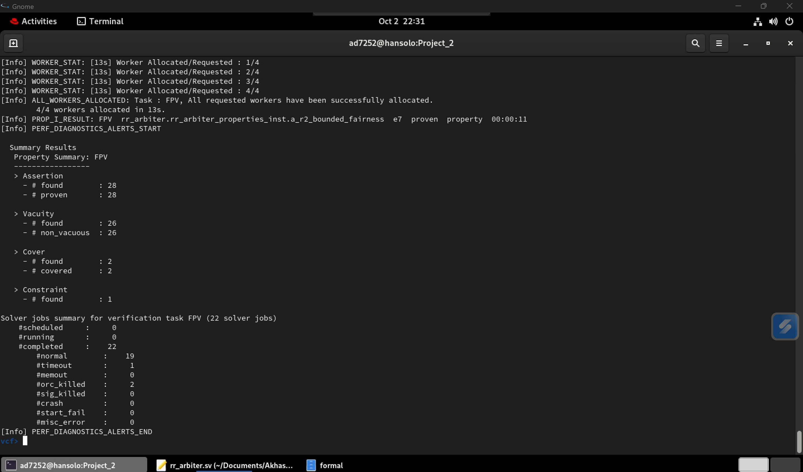
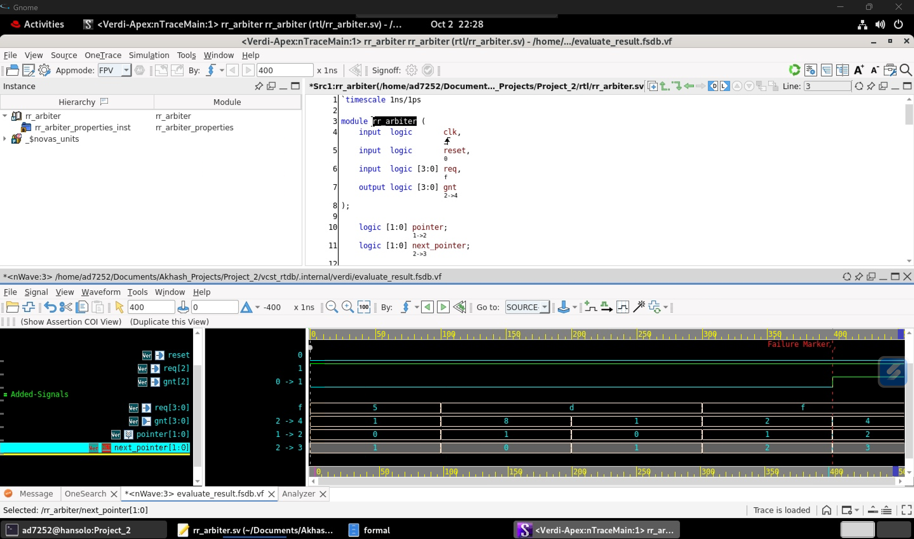

# Formal Verification of a 4-Requester Round-Robin Arbiter

A SystemVerilog implementation and formal verification environment for a
4-requester round-robin arbiter using **SystemVerilog Assertions (SVA)** and
**Synopsys VC Formal**.

The project focuses on proving arbitration safety, functional correctness,
state-transition behavior, and bounded fairness across arbitrary request
patterns. Formal cover properties are also used to check reachability, and an
intentional RTL bug was injected to practice counterexample-driven debugging.

## Project Overview

The arbiter accepts four request signals:

```text
req[3:0]
```

and produces a one-hot grant vector:

```text
gnt[3:0]
```

A 2-bit internal priority pointer determines which requester receives highest
priority during the current arbitration opportunity.

The priority order rotates as follows:

| Pointer | Priority Order |
|---|---|
| `00` | R0 → R1 → R2 → R3 |
| `01` | R1 → R2 → R3 → R0 |
| `10` | R2 → R3 → R0 → R1 |
| `11` | R3 → R0 → R1 → R2 |

After a requester is granted, the pointer advances to the requester immediately
following the winner.

For example:

```text
R0 grant → next priority starts at R1
R1 grant → next priority starts at R2
R2 grant → next priority starts at R3
R3 grant → next priority wraps to R0
```

If no request is active, no grant is generated and the priority pointer remains
unchanged.

## Architecture



The design separates:

- sequential pointer state using `always_ff`
- combinational arbitration using `always_comb`
- one-hot grant generation
- next-pointer computation

## Repository Structure

```text
Project_2/
├── rtl/
│   └── rr_arbiter.sv
├── tb/
│   └── tb_rr_arbiter.sv
├── formal/
│   ├── rr_arbiter_properties.sv
│   └── run_fpv.tcl
├── docs/
│   ├── formal_proof_summary.png
│   └── r2_bounded_fairness_counterexample.png
├── .gitignore
└── README.md
```

## Verification Methodology

Verification was divided into five property groups.

### 1. Safety and Progress

The basic properties check that:

- at most one requester is granted at a time
- a grant is never issued to an inactive requester
- at least one grant is produced whenever requests are active

Representative assertions include:

```systemverilog
$onehot0(gnt)
```

and:

```systemverilog
(gnt & ~req) == 4'b0000
```

### 2. Round-Robin Selection Correctness

All four pointer states are checked against their complete priority ordering.

For example, when the priority pointer is R1:

```text
R1 → R2 → R3 → R0
```

if R1 is inactive and R2 is requesting, R2 must receive the grant regardless of
lower-priority requests:

```systemverilog
(pointer == 2'b01 && !req[1] && req[2])
|-> (gnt == 4'b0100)
```

The verification environment contains **16 selection assertions**, covering all
four possible winners for each of the four pointer states.

### 3. Pointer / State-Transition Correctness

Temporal assertions verify that each grant produces the correct next priority
state.

For example:

```systemverilog
(!$past(reset) && $past(gnt) == 4'b0100)
|-> (pointer == 2'b11)
```

checks that an R2 grant causes the next priority to start at R3.

The environment also proves that the pointer remains unchanged during idle
cycles.

### 4. Bounded Fairness

The arbiter must not indefinitely starve a requester that remains continuously
asserted.

For four requesters, a continuously requesting client can be denied by at most
three other arbitration opportunities before it must receive service.

For example:

```systemverilog
(req[2] && !gnt[2])[*3] ##1 req[2]
|-> gnt[2]
```

checks the bounded-fairness requirement for R2.

Equivalent properties are included for all four requesters.

Request inputs are not globally constrained to a particular traffic pattern.
Instead, request persistence is encoded locally in the fairness property
antecedents.

### 5. Formal Cover / Reachability

Cover properties were used to verify that important scenarios are reachable.

These include:

- all four requesters active simultaneously
- a complete R0 → R1 → R2 → R3 grant rotation while all requests remain active

Example:

```systemverilog
(req == 4'b1111 && gnt == 4'b0001)
##1
(req == 4'b1111 && gnt == 4'b0010)
##1
(req == 4'b1111 && gnt == 4'b0100)
##1
(req == 4'b1111 && gnt == 4'b1000)
```

## Formal Verification Results

The final VC Formal run produced:

| Verification Result | Count |
|---|---:|
| Assertions found | 28 |
| Assertions proven | **28** |
| Assertions falsified | **0** |
| Vacuity checks | 26 |
| Non-vacuous | **26** |
| Cover properties | 2 |
| Covers reached | **2** |



The non-vacuity results help verify that implication-based assertions were not
passing merely because their antecedents were unreachable.

## Counterexample-Driven Debugging

An intentional priority-order defect was injected into the R1 arbitration state.

The correct priority was:

```text
R1 → R2 → R3 → R0
```

and was temporarily changed to:

```text
R1 → R3 → R2 → R0
```

VC Formal detected the defect and falsified two properties:

```text
a_ptr_r1_choose_r2
a_r2_bounded_fairness
```

The first property exposed the immediate functional error: R3 could incorrectly
receive a grant while R2 had higher round-robin priority.

The second showed a temporal consequence of the same defect: under a legal
sequence of requests, R2 could remain continuously asserted and exceed the
specified service bound.



One counterexample state contained:

```text
pointer = 1
req     = D (4'b1101)
gnt     = 8 (4'b1000)
```

With `pointer = R1`, both R2 and R3 were requesting while R1 was inactive.

The correct priority required R2 to win:

```text
R1 → R2 → R3 → R0
     ↑
```

but the injected defect selected R3 instead.

Tracing backward from the eventual fairness failure identified this arbitration
decision as the earlier divergence responsible for the incorrect state
trajectory.

The correct RTL was then restored and the full formal suite was rerun
successfully.

## Simulation Sanity Check

Before formal verification, a simple SystemVerilog testbench was used for basic
simulation sanity checking.

The testbench exercises:

- simultaneous requests from all four clients
- full round-robin rotation
- idle behavior
- a single R2 request
- simultaneous R3 and R0 requests

Simulation provides an initial functional check, while formal verification is
used to reason over arbitrary legal request sequences.

## Formal Flow

The VC Formal flow is automated using:

```text
formal/run_fpv.tcl
```

The script:

1. analyzes the RTL
2. analyzes the SVA property module
3. elaborates `rr_arbiter`
4. defines the clock
5. defines active-high reset
6. launches Formal Property Verification

Run from the repository root:

```tcl
vcf -fmode FPV -f formal/run_fpv.tcl
```

The property module is attached to the DUT using SystemVerilog `bind`, keeping
verification properties separate from the RTL implementation.

## Tools and Languages

- SystemVerilog
- SystemVerilog Assertions (SVA)
- Synopsys VC Formal / VC Static
- Synopsys VCS
- Verdi
- Tcl
- Linux

Development and formal verification were performed using Synopsys
Y-2026.03-series tools.

## Key Concepts Demonstrated

This project exercises:

- round-robin arbitration
- one-hot grant checking
- safety properties
- temporal assertions
- bounded liveness / fairness
- starvation detection
- state-transition verification
- `$past`
- SVA repetition and sequence delays
- assertion vacuity
- formal reachability using `cover property`
- unconstrained formal inputs
- SystemVerilog `bind`
- counterexample analysis
- waveform-based root-cause debugging
- automated formal flows using Tcl

## Takeaway

The project demonstrates how formal verification can complement simulation by
proving behavioral guarantees across legal request sequences rather than only
testing manually selected scenarios.

The intentional bug-injection experiment also demonstrates how targeted
functional and fairness properties can detect errors that simpler properties
such as mutual exclusion, grant validity, and basic progress may still allow.
